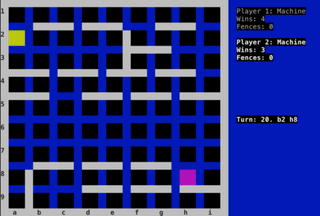

# Zoridor

A terminal and web version of the [Quoridor](https://en.wikipedia.org/wiki/Quoridor) board game

[WASM4](https://wasm4.org/) version on [wasm4 branch](https://github.com/ringtailsoftware/zoridor/tree/wasm4).

Play on the web at https://ringtailsoftware.github.io/zoridor/

Quoridor tutorials:

 - https://www.youtube.com/watch?v=39T3L6hNfmg
 - https://www.youtube.com/watch?v=FDdm-EgRy9g
 - https://www.youtube.com/watch?v=6ISruhN0Hc0

# Running

Get [Zig](https://ziglang.org/download/)

Terminal version:

    zig build run

Web version:

    zig build -Dweb=true && zig build serve -- zig-out -p 8000

Browse to http://localhost:8000

# Development

Auto-rebuild and reload on change

    watchexec -r --stop-signal SIGKILL -e zig,html,css,js,zon -w src 'zig build -Dweb=true && zig build serve -- zig-out -p 8000'

# Terminal mode controls

 - You are Player 1. Your objective is to move your red pawn from the top of the board to the bottom of the board
 - Player 2 starts at the bottom and is attempting to reach the top of the board
 - On each turn you can either move your pawn or add one fence piece to the board (you have 10 to start with)

## Moving a pawn

 - Use the cursor keys to choose where to move to. Your pawn may only move one square on each turn and cannot move diagonally
 - The "[ ]" mark where your pawn will move and is coloured green for a valid move and red for invalid
 - Once you have selected a move, press enter to move the pawn

## Adding a fence

 - Press tab to switch from pawn to fence mode
 - Use the cursor keys to choose where to add the fence
 - Fences must not cross other fences, or completely block either player from reaching their goal. An invalid fence position will be shown in red
 - To rotate the fence, press space
 - Once you have positioned the fence, press enter to place it

# Command line options

Help

    zig build run -- -h

To watch machine vs machine matches forever:

    zig build run -- -1 machine -2 machine -f

On exit, a record of all moves is printed in both Glendenning format and base64. The base64 format can be reloaded with `zig build run -- -l jcNJujqxKRY2sA==`

# Theory

For a comprehensive examination of playing Quoridor, see [Lisa Glendenning's Thesis](https://www.labri.fr/perso/renault/working/teaching/projets/files/glendenning_ugrad_thesis.pdf)

